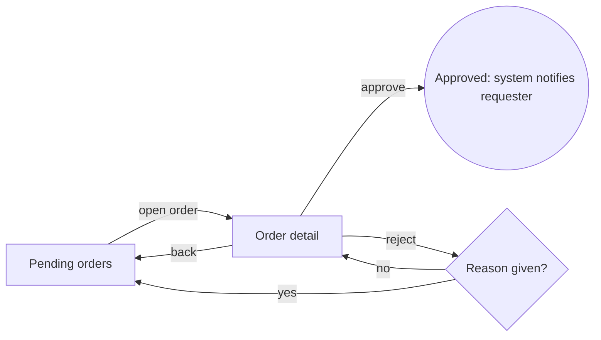

# UX blueprint template (per objective)

<!--
The UX blueprint of one objective (Forward spec/product-pipeline.md, "Stage contracts": "UX blueprint is authored
with product requirements, before UI construction, and reconciled with domain/architecture before sign-off").

It is NOT a new artifact path. It is written into the Forward design family of the front demand:

  specs/<demand-id>/design/intended-model.md   Part 1 — actors, jobs, primary actions, consequences, acceptance
                                                scenarios (fde-spec writes it; fde-walkthrough reads it). At XS/S a
                                                concise Part 1 plus the existing references carries the blueprint.
  specs/<demand-id>/design/flow.md              Part 2 — task sequence, decisions, errors, empty/loading,
                                                abandon/resume, handoffs (Mermaid). M/L.
  specs/<demand-id>/design/ia.md                Part 3 — screens, objects, permissions, states, nomenclature. L (or
                                                whenever the objective adds a place worth linking).

UX.md (product level) versus this blueprint (objective level): UX.md holds the conventions every screen of the
product follows (archetype per screen, action position, required states, glossary, forbidden terms, deviations). The
blueprint holds the contract of ONE objective: which actors do which job through which screens, and how each is
accepted. The blueprint cites UX.md policies by key and never restates them; a blueprint need that contradicts UX.md
is either a declared deviation in UX.md or a UX.md revision in the same cycle.

Check: node <DSX>/tools/ux-lint/blueprint.mjs check --design specs/<demand-id>/design [--spec specs/<demand-id>/spec.md]
       [--screens <captures>] [--map .dsx/maps/flows-<module>.json] [--journey <journey id>]
Before UI only the sections, requirements and scenarios are checked; after UI the captures and the flow map are
checked against the blueprint in both directions (DOM-5: no orphans, both ways).

Keep the table headers below as written: blueprint.mjs reads them. Screen ids are the ids of the flow map
(.dsx/maps/flows-<module>.json) and of the capture files (<nn>-<screen-id>[.<state>].html).
Example content is a neutral purchase-order product; replace it.
-->

---

<!-- ===== Part 1 → specs/<demand-id>/design/intended-model.md ===== -->

# Intended model — <demand-id>

date: YYYY-MM-DD
owner-role: fde-spec
sources: spec.md@<sha>, UX.md@<sha>, docs/map/<feature>.md@<sha>
criteria: A3, A4

## What this is

<One line a first-time visitor should be able to say back: "a place to approve purchase orders waiting for me".>

## Actors and jobs

| actor | job | frequency | permissions |
|---|---|---|---|
| approver | approve or reject a pending purchase order with its reason | daily | sees orders of own cost centre; cannot edit amounts |
| requester | follow the status of an order and answer a rejection | weekly | sees own orders |

## Primary actions and consequences

| action | consequence |
|---|---|
| approve order | the order leaves the queue and the requester is notified |
| reject order | asks for a reason; the order returns to the requester |

## Unclear points to avoid

- whether "reject" deletes the order (it does not: it returns it)

## Acceptance scenarios

| id | requirement | scenario | screens | verified by |
|---|---|---|---|---|
| S1 | R1 | approver with 25 pending orders approves the oldest one | queue, order | evals/journeys/<demand-id>/approve.journey.toml |
| S2 | R2 | approver rejects without a reason and is asked for one; typed text is kept | order | evals/journeys/<demand-id>/reject.journey.toml |
| S3 | R3 | the queue is empty and says what happens next | queue | capture queue.empty |

---

<!-- ===== Part 2 → specs/<demand-id>/design/flow.md ===== -->

# Flow — <demand-id>

## Flow

## Decisions

- **Reason given?** — a rejection without a reason stays on the order with the field in error (R2).

## Feedback

- Approve and reject confirm in place and move focus to the next order (USE-1).

## Errors

- Save fails: the message says what happened and keeps the typed reason (USE-4).

## Empty and loading

- Empty queue: says no order is waiting and when new ones arrive. Loading keeps the layout (skeleton rows).

## Abandon and resume

- Leaving with a typed reason keeps it as a draft for that order.

## Handoffs

| from | to | notification | deadline | what the recipient sees |
|---|---|---|---|---|
| approver | requester | e-mail + in-app | answer within 5 working days | the rejection reason on the order |

---

<!-- ===== Part 3 → specs/<demand-id>/design/ia.md ===== -->

# Information architecture — <demand-id>

## Screens

| id | name | route | requirements | states | job |
|---|---|---|---|---|---|
| queue | Pending orders | /orders/pending | R1, R3 | success, empty, loading, error | find the next order to decide |
| order | Order detail | /orders/:id | R1, R2 | success, error | decide one order |

## Objects

| object | attributes (at the cardinality-correct level, DOM-1) | states | enforced in |
|---|---|---|---|
| purchase order | number, requester, cost centre, total; lines carry their own item and amount | pending, approved, rejected | API + DB |

## Permissions

- Hidden versus unavailable: an approver of another cost centre does not see the order; an order already decided
  shows the decision and no action (explained, without exposing restricted data).

## Accessibility

- Focus order: queue row → order heading → approve → reject. Reject reason field has a visible label.

## Nomenclature

- "Reject" (never "decline" or "deny"), following UX.md `content.glossary`.
