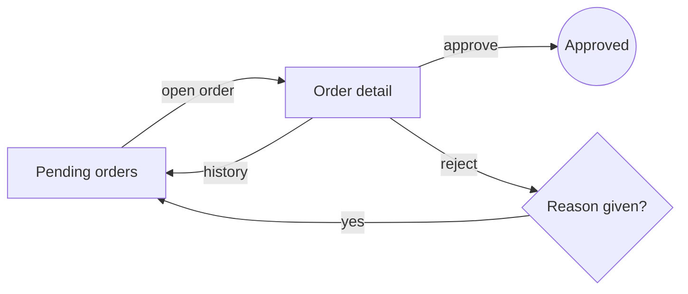

# Flow — DEM-1

## Flow

## Decisions

- Reason given? A rejection without a reason stays on the order.

## Feedback

- Approve confirms in place.

## Errors

- Save fails and keeps the typed reason.

## Empty and loading

- Empty queue says when orders arrive.

## Abandon and resume

- A typed reason is kept as a draft.
